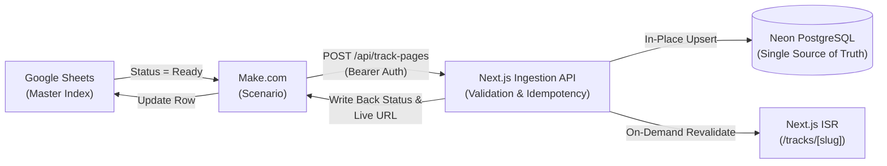

# B2BProductionMusic.com
## Master Keyword File & Make.com Automation Pipeline
### Technical Standard Operating Procedure (SOP) & Client Handover Guide

---

## 1. System Architecture Overview

The programmatic publishing pipeline automates the generation of SEO-optimized, highly converting track landing pages from Google Sheets to the live production website.



### Key Technical Guarantees
1. **Zero Duplicate URLs / Slugs**: Canonical slugs are generated from buyer search intent keywords. Re-publishing or editing a track in the spreadsheet updates the database record in-place without appending `-2` or breaking Google indexation.
2. **On-Demand ISR**: Only the specific track page is re-rendered in seconds; the rest of the site remains lightning fast without full rebuilds.
3. **Structured SEO**: Every page automatically renders Google Schema.org (`Product`, `AudioObject`, `BreadcrumbList`) metadata.

---

## 2. Master Keyword File Structure (Google Sheets)

Create a Google Sheet titled **`B2B Music Master Index`** with the following 17 columns (Columns A through Q):

| Col | Field Name | Data Type | Required? | Description & Example |
| :---: | :--- | :--- | :---: | :--- |
| **A** | `Title` | String | **Yes** | Commercial track title. *Example:* `Apex Solar Pulse` |
| **B** | `Target Keyword` | String | **Yes** | High-intent long-tail search query. *Example:* `futuristic solar automotive commercial soundtrack` |
| **C** | `Genre` | String | **Yes** | Primary genre. *Example:* `Electronic`, `Cinematic`, `Hip Hop`, `Indie Rock` |
| **D** | `BPM` | Integer | **Yes** | Beats per minute. *Example:* `128` |
| **E** | `Musical Key` | String | No | Harmonic key. *Example:* `A Minor`, `D Major` |
| **F** | `Duration` | String | No | Formatted `M:SS`. *Example:* `2:45` |
| **G** | `Description` | Text | **Yes** | 2–3 sentences describing the mood, instrumentation, and intended video workflow. |
| **H** | `Moods` | Text (CSV) | **Yes** | Comma-separated tags. *Example:* `Futuristic, Driving, Confident, Euphoric` |
| **I** | `Use Cases` | Text (CSV) | **Yes** | Comma-separated sync scenarios. *Example:* `Automotive Ads, SaaS Demos, Tech Launches` |
| **J** | `Audio URL` | URL | **Yes** | Direct public link to preview MP3 (128–192 kbps). Hosted on S3, R2, or Supabase. |
| **K** | `Cover Image URL`| URL | No | High-res album square artwork (1000x1000px JPG/PNG). |
| **L** | `Standard Price` | Number | **Yes** | Web & Social license price in USD. *Default:* `10` |
| **M** | `Commercial Price`| Number | **Yes** | Paid Ads & Agency license price in USD. *Default:* `20` |
| **N** | `Broadcast Price` | Number | **Yes** | TV & Full Buyout license price in USD. *Default:* `40` |
| **O** | `Status` | Dropdown | **Yes** | Values: `Draft`, `Ready`, `Published`, `Error`. Set to `Ready` to trigger publishing. |
| **P** | `Live URL` | URL | Output | Auto-populated by Make.com write-back. *Example:* `https://b2bproductionmusic.com/tracks/futuristic-solar-automotive-commercial-soundtrack` |
| **Q** | `Track ID` | String | Output | Auto-populated by Make.com write-back. *Example:* `trk_46cbb54d241740fa` |

---

## 3. SEO Target Keyword Strategy Formula

To achieve top organic rankings, each track's `Target Keyword` should follow this proven formula:

$$\text{Target Keyword} = [\text{Mood / Tone}] + [\text{Genre / Style}] + [\text{Target Production Use Case}] + [\text{"Music"} \mid \text{"Soundtrack"} \mid \text{"Background Music"}]$$

### High-Converting Examples:
- `cinematic documentary ambient background music` (Genre: Cinematic, Mood: Ambient, Intent: Documentaries)
- `upbeat corporate tech presentation background music` (Genre: Corporate, Mood: Inspiring, Intent: Tech SaaS)
- `energetic commercial advertisement soundtrack` (Genre: Electronic, Mood: High-Velocity, Intent: TV/Web Ads)
- `acoustic folk lifestyle brand commercial music` (Genre: Folk, Mood: Warm, Intent: Fashion & Lifestyle)
- `dark hybrid trailer brass soundscape` (Genre: Cinematic, Mood: Menacing, Intent: Video Game & Film Trailers)

> [!TIP]
> **Avoid Keyword Cannibalization**:
> Never give two tracks the exact same `Target Keyword`. Each track should represent a distinct sub-niche (e.g., one for *"automotive commercial music"*, another for *"crypto fintech explainer music"*).

---

## 4. Make.com Scenario Configuration (Step-by-Step)

The Make.com scenario consists of 3 straightforward modules:

### Module 1: Google Sheets — "Search Rows" (or "Watch New Rows")
- **Spreadsheet**: Select `B2B Music Master Index`
- **Sheet**: `Sheet1`
- **Filter**:
  - `Status` **Equal to (case insensitive)** `Ready`
- **Maximum number of returned rows**: `5` *(processes in controlled batches to avoid API timeouts)*

---

### Module 2: HTTP — "Make a request"
- **URL**: `https://<your-vercel-domain>/api/track-pages`
- **Method**: `POST`
- **Headers**:
  1. `Authorization`: `Bearer <INGESTION_API_KEY>`
  2. `Content-Type`: `application/json`
- **Body Type**: `Raw`
- **Content type**: `JSON (application/json)`
- **Request Content**:

```json
{
  "id": "{{1.Q}}",
  "title": "{{1.A}}",
  "targetKeyword": "{{1.B}}",
  "genre": "{{1.C}}",
  "bpm": {{1.D}},
  "musicalKey": "{{1.E}}",
  "duration": "{{1.F}}",
  "description": "{{1.G}}",
  "moods": {{split(1.H; ", ")}},
  "useCases": {{split(1.I; ", ")}},
  "audioUrl": "{{1.J}}",
  "coverImageUrl": "{{1.K}}",
  "prices": {
    "standard": {{1.L}},
    "agency": {{1.M}},
    "broadcast": {{1.N}}
  }
}
```

*(Note: `{{split(1.H; ", ")}}` converts the comma-separated string into a clean JSON array).*

---

### Module 3: Google Sheets — "Update a Row"
- **Spreadsheet**: Select `B2B Music Master Index`
- **Sheet**: `Sheet1`
- **Row number**: `{{1.__ROW_NUMBER__}}`
- **Field Mappings**:
  - `Status` (Col O): `Published`
  - `Live URL` (Col P): `{{2.data.data.liveUrl}}`
  - `Track ID` (Col Q): `{{2.data.data.id}}`

---

## 5. How Idempotency Protects Long-Term Edits

When the client edits an existing track 6 months from now (e.g. updating pricing from \$10 to \$15, refining the description, or adding new use-case tags):

1. The client modifies the row in Google Sheets.
2. The client sets `Status` back to `Ready`.
3. The Make.com scenario triggers and passes the payload containing `id: trk_...`.
4. The API recognizes the existing record in Neon Postgres:
   - **Canonical Slug Retained**: It **does NOT** change the URL or append `-2`.
   - **In-Place DB Update**: It updates the fields in PostgreSQL immediately.
   - **Instant ISR Revalidation**: It flushes the Vercel cache for that specific URL.
   - **Search Engine Ranking Preserved**: Backlinks, Google bookmarks, and rankings remain intact.

---

## 6. Copy-Paste CSV Sample Template

You can import this directly into Google Sheets to initialize your master index:

```csv
Title,Target Keyword,Genre,BPM,Musical Key,Duration,Description,Moods,Use Cases,Audio URL,Cover Image URL,Standard Price,Commercial Price,Broadcast Price,Status,Live URL,Track ID
Apex Solar Pulse,futuristic solar automotive commercial soundtrack,Electronic,128,A Minor,2:45,"High-energy analog synth pulse built for EV commercials and tech launches. Features pulsing arpeggios and punchy low-end headroom calibrated for voiceovers.","Futuristic, Confident, Driving, Tech","Automotive Commercials, Tech Launch, YouTube Promo",https://storage.googleapis.com/b2bmusic-audio/apex-solar-pulse.mp3,https://b2bmusic.vercel.app/banners/banner-spark-energy.jpg,10,20,40,Ready,,
Neon Horizon,synthwave driving city night soundtrack,Electronic,118,F Minor,3:12,"Atmospheric synthwave and analog tape chords evoking late-night highway city driving. Ideal for tech podcasts and SaaS product videos.","Atmospheric, Retro, Melancholic, Chill","SaaS Explainer, Podcast Intro, Brand Reel",https://storage.googleapis.com/b2bmusic-audio/neon-horizon.mp3,https://b2bmusic.vercel.app/banners/banner-dj-producer.jpg,10,20,40,Ready,,
Titan Ascent,cinematic hybrid orchestral trailer music,Cinematic,96,D Minor,2:30,"Epic hybrid orchestral cues featuring massive brass swells, taiko percussion hits, and sub-bass impacts. Calibrated for theatrical film trailers and gaming spots.","Epic, Powerful, Heroic, Dramatic","Movie Trailers, Video Games, Sports Broadcasts",https://storage.googleapis.com/b2bmusic-audio/titan-ascent.mp3,https://b2bmusic.vercel.app/banners/banner-festival-stage.jpg,10,20,40,Ready,,
Acoustic Meadow,warm acoustic folk lifestyle brand commercial music,Folk,104,G Major,2:50,"Handcrafted Martin acoustic guitars with warm upright bass and subtle organic shaker percussion. Perfect for sustainable lifestyle and coffee brand spots.","Warm, Organic, Earthy, Uplifting","Lifestyle Commercials, Food & Beverage, Travel Documentaries",https://storage.googleapis.com/b2bmusic-audio/acoustic-meadow.mp3,https://b2bmusic.vercel.app/banners/banner-crowd-amber.jpg,10,20,40,Ready,,
```

---

## 7. Audio File Hosting Best Practices

- **Recommended Host**: **Cloudflare R2** (Zero egress fees) or **AWS S3** / **Google Cloud Storage**.
- **CORS Configuration**: Allow `GET` requests with `Access-Control-Allow-Origin: *` so the Next.js HTML5 audio player and waveform engine can stream and analyze the audio buffer.
- **Bitrate**: Export preview files at `192 kbps MP3` (CBR or VBR) for the fastest playback start time without sacrificing fidelity.
