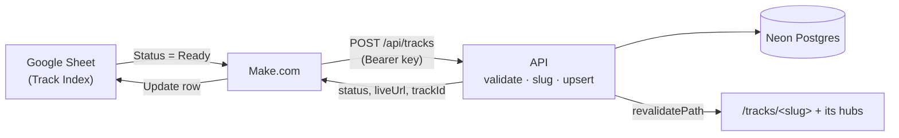

# GlobalB2BAudioHolding.com — Master Keyword Index Guide

How to fill in the Google Sheet master index so each row becomes a strong, unique landing page.

- **Make.com set-up:** follow [`make-scenario.md`](make-scenario.md). It is the only supported scenario configuration.
- **API contract:** see [`api.md`](api.md).
- **Validation rules and day-to-day operations:** see the [README](../README.md).

---

## 1. How a row becomes a page


```mermaid
flowchart LR
    A["Google Sheet<br/>(Track Index)"] -->|"Status = Ready"| B["Make.com"]
    B -->|"POST /api/tracks<br/>(Bearer key)"| C["API<br/>validate · slug · upsert"]
    C --> D[("Neon Postgres")]
    C -->|"revalidatePath"| E["/tracks/&lt;slug&gt; + its hubs"]
    C -->|"status, liveUrl, trackId"| B
    B -->|"Update row"| A
```

- **One URL per track, and it never changes.** The slug is built from the **Target Keyword** the first time a track is published. Later edits update the same record and keep the same URL, so rankings and backlinks survive.
- **Only the affected pages refresh.** That means the track page and its genre, BPM and use-case hubs. There is no full rebuild, and the pages are live within seconds.
- **Every page gets structured data automatically:** `Product` with three license offers, `AudioObject` and `BreadcrumbList`.

---

## 2. Sheet columns (A–Q)

The column headers must match `fixtures/sample-track-index.csv` exactly.

| Col | Field | Required | Notes |
| :-: | :-- | :-: | :-- |
| A | Title | Yes | The track title as shown to buyers. |
| B | Target Keyword | Yes | The buyer search phrase the page targets; the slug is built from it. It must be unique across the catalog (see §3). |
| C | Genre | Yes | Dropdown: `Electronic`, `Cinematic`, `Corporate / Tech`, `Hip Hop`, `Indie Rock`, `Folk & Acoustic`, `Ambient`. Any other value is rejected. |
| D | BPM | Yes | Integer, e.g. `128`. It places the track in a tempo hub (under 90, 90–124, or 125+). |
| E | Musical Key | No | For example `A Minor`. It is shown as a badge with its Camelot code. |
| F | Duration | No | `M:SS`. Format the column as *Plain text* so Sheets doesn't turn it into a time of day. |
| G | Description | Yes | At least 60 characters, and never copied from another row (see §4). Supports simple formatting (see §4). |
| H | Moods | Yes | Comma-separated, e.g. `Driving, Confident, Euphoric`. |
| I | Use Cases | Yes | Comma-separated. Each use case gets its own hub page. |
| J | Audio URL | Yes | The **watermarked** 128 kbps preview MP3 made by `npm run audio:watermark`. The API checks that it responds before publishing. |
| K | Cover Image URL | No | Square artwork, at least 1000×1000 JPG. If blank, the brand share image is used. |
| L–N | Standard / Commercial / Broadcast Price | Yes | USD, e.g. `10`, `20`, `40`. Checkout always charges the price stored in the database. |
| O | Status | Yes | `Draft`, `Ready`, `Published` or `Error`. Set it to **Ready** to publish. |
| P | Live URL | Output | Written back by Make.com. Leave blank. |
| Q | Track ID | Output | A numeric ID written back by Make.com. **Never edit it.** It is how later edits update the same page. |
| — | Master WAV | For sales | Path of the 24-bit WAV master in the **private** bucket, e.g. `masters/titan-ascent.wav` (from the watermark manifest). Never a URL. Buyers and subscribers download it through the site. |
| — | Master AIFF | No | Same, for the AIFF master. |

---

## 3. Choosing Target Keywords

Build each keyword from four parts:

**[mood / tone] + [genre / style] + [production use case] + "music" | "soundtrack" | "background music"**

Examples:

- `cinematic documentary ambient background music`
- `upbeat corporate tech presentation background music`
- `energetic commercial advertisement soundtrack`
- `warm acoustic folk lifestyle brand commercial music`
- `dark hybrid trailer brass soundscape`

Rules:

- **One keyword per track.** The API rejects a duplicate Target Keyword (HTTP 409) so that two pages never compete for the same search.
- **Use real buyer phrasing.** Write it the way an editor would type it into Google, not the way you'd name the track internally.
- **Choose it with care.** Once a track is published, its URL stays the same even if you change the keyword later.

---

## 4. Writing descriptions that rank

Google skips thin or near-duplicate pages. Every description should be specific to its track:

- What the track sounds like: instrumentation, arc, and where it builds or drops.
- Where it works in an edit: under voiceover, for a logo sting, or for a 30-second cutdown.
- Who it's for: the use cases in column I.

The Description cell supports simple formatting:

| You type | Page shows |
|---|---|
| A blank line between paragraphs | Separate paragraphs |
| Lines starting with `- ` | A bulleted list |
| `**text**` | **Bold** |

HTML is not rendered. It shows as plain text.

---

## 5. Editing a published track

1. Change the row: price, description, moods and so on. Leave **Track ID** as it is.
2. Set **Status** back to **Ready**.
3. Make.com sends the row again with its Track ID. The API updates the existing record, keeps the same URL, and refreshes that page and its hubs.

---

## 6. Test batch

Use `fixtures/sample-track-index.csv` as a template. To validate a batch without publishing anything:

```bash
npm run import:sheet -- fixtures/sample-track-index.csv --dry-run
```

The README explains how to publish a batch to staging.

---

## 7. Audio hosting

The full set-up is in [`audio-and-access.md`](audio-and-access.md). In short:


- **Host:** Cloudflare R2 (no egress fees), AWS S3 or Google Cloud Storage. The URL must be public and must not expire.
- **Preview files:** 128–192 kbps MP3. Previews only load when a visitor presses play, so file size doesn't slow down page loads, but smaller files start playing sooner.
- **CORS:** allow `GET` from the site's domain.
